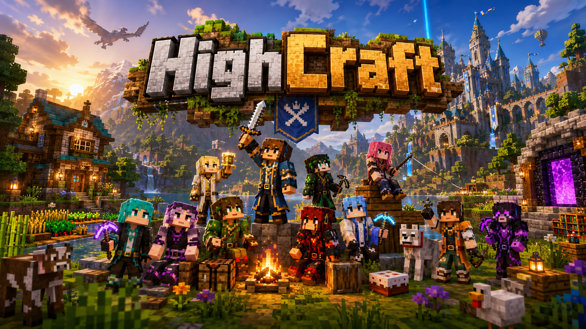

# HighCraft W/ The Boys

<p align="center">
  
</p>

<p align="center">
  <strong>One Minecraft world. A bunch of friends. No speedrunning.</strong><br />
  Towns · kingdoms · bosses · stupid infrastructure · a history only this crew could make.
</p>

<p align="center">
  <a href="https://otterdays.github.io/High-Craft/"></a>
  <a href="https://otterdays.github.io/Minecraft-Stuffs/"></a>
</p>

**Live:** [otterdays.github.io/High-Craft](https://otterdays.github.io/High-Craft/)  
**Project hub:** [otterdays.github.io/Minecraft-Stuffs](https://otterdays.github.io/Minecraft-Stuffs/)

---

## What this is

HighCraft is a long-term survival series and community world — plus the public landing page for [Otters MC Studios](https://otterdays.github.io/Minecraft-Stuffs/) mods, tools, and experiments that grow up around it.

The site leans **Minecraft Wiki** structure (light content panels, clear sections) with **classic Minecraft** framing (dirt header, pixel-tiled cobblestone + oak-log post + oak-plank side rails, beveled buttons) and a full-bleed game-landing hero. A floating **server version** chip stays on-screen while you scroll (minimize collapses it to a tab — it never fully goes away).

## Play with us

| | |
|--|--|
| **Address** | Java Edition · `afykirby.aternos.me` |
| **Server** | Minecraft: **Java Edition** · **26.3** · Snapshot **10** (not Bedrock) |
| **Modpack** | [Fabulously Optimized](https://modrinth.com/modpack/fabulously-optimized) (Fabric — recommended Java Edition client pack). Most likely still on current stable **Java Edition 26.2**, not our snapshot world. |
| **Host** | Free on [Aternos](https://aternos.org/) for now. If the world is offline, message the host to start it up — Aternos shuts inactive servers down on the free plan to save resources on their end. |

The same address and note live in the `#join` banner on `index.html`. Keep README and the site in sync when the IP or host changes.

## The Boys (so far)

| Player | Gamertag |
|--------|----------|
| Ryan | Darksora269 |
| Nick D | Porta Jawn Shidda |

More slots on the site stay open until the rest of the crew is named.

## Repo layout

```
High-Craft/
├── index.html                 # public landing (HTML + CSS + JS)
├── games/
│   ├── index.html             # internal lab index
│   └── high-craft-2d-v1/      # sketch: index.html, game.css, game.js, hc2d-core.js
├── tests/                     # Node suite only (no browser). `node tests/run.js`
├── assets/images/             # promo art + sample shots
│   └── textures/              # 16×16 rail tiles (cobble, stone, oak planks, oak log)
├── DOCS/                      # internal notes (GDD, scratchpad)
├── AGENTS.md                  # rules for AI / contributors
└── README.md                  # you are here
```

**Games** in the top bar opens the lab. Those pages are internal sketches, not a HighCraft release. The 2D toy is not part of the public series pitch.

Same static rules: no install, no build, no backend. GitHub Pages from `main` / root. No Actions. Relative links only.

## Run locally

Open `index.html` in a browser, or:

```powershell
npx --yes serve .
```

No install. No build. No backend.

**Script tests (agents: this is the only allowed check):**

```powershell
node tests/run.js
```

Layer 1 tests the harness. Layer 2 tests High Craft 2D core. No browser tests.

## Edit without breaking the vibe

**Studio project cards** — `projects` array near the bottom of `index.html`

1. Copy an object  
2. Set name, description, tags, URL  
3. `category`: `server` | `mod` | `tool` | `game`  
4. `highcraft: true` → shows under HighCraft Picks  
5. In-repo pages (High Craft 2D): relative `url` + `linkLabel: "Play"` — not a GitHub link  

**Internal games lab** — `games/index.html` listing + a folder per toy. High Craft 2D V1 is `games/high-craft-2d-v1/` and also a **HighCraft Picks** card on the landing. Keep dealing copy off the hero. Design notes in `DOCS/GDD_HIGH_CRAFT_2D.md`.

**Crew roster** — `#players` grid in `index.html` (display name + gamertag)

**Server IP** — `#join` banner in `index.html` (address + Aternos note). Mirror the same values in this README.

**Server version chip** — `#serverVersion` in `index.html` (update the version string when the world bumps)

**Modpack note** — `#modpack` banner in `index.html` (stable-release lag; currently 26.2). Mirror in this README.

**Imagery** — drop files in `assets/images/` and point the hero / gallery / season blocks at them

## GitHub Pages

Deployed from **`main`** → **`/` (root)**.  
If the live URL 404s: **Settings → Pages → Deploy from a branch → `main` / root**.

---

Built by the boys. Probably destroyed by the boys.
